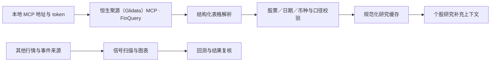

# 恒生聚源（Glidata）MCP 接入说明

恒生聚源（Glidata）MCP 用于补充个股研究数据。通过 FinQuery 查询后，返回的表格会经过字段检查并写入本地缓存，供研究页面读取。

## 接入路径



适配代码位于 `agent/gildata_shadow_service.py`，查询脚本为 `agent/scripts/probe_gildata_shadow.py`；工具目录与有限美股类别采样使用`agent/scripts/probe_gildata_us_catalog.py`。支持同日期市值、原始五档评级、目标价、年度EPS、公司简介与分类、EPS/营收修正及分歧，以及可选日VIX；可用字段取决于实际返回，PE可能缺失。

## 配置

从 agent/.env.example 复制生成本地 agent/.env，并填入自己的配置：

```dotenv
GILDATA_MCP_URL=
GILDATA_MCP_TOKEN=
# 仅在需要时启用按日期匹配的缓存 VIX 回退
GILDATA_VIX_FALLBACK=0
# 以下为可选后台刷新，默认关闭；不激活新因子
GILDATA_REFERENCE_PRIMARY=0
GILDATA_RESEARCH_ENABLED=0
GILDATA_NEWS_SUPPLEMENT=0
# 可选日批行情补洞：需现有连续历史锚点验证，不是页面实时行情。
GILDATA_DAILY_PRIMARY=0
```

MCP 地址须为HTTPS且不含用户名、密码、查询参数或片段。服务地址、token和授权请通过 [恒生聚源数据地图](https://www.gildata.com/products/datamap) 自行获取，token单独配置。公开版本没有预置服务地址或token，不应在GitHub提交自己的agent/.env、带认证URL或MCP客户端私有配置。

在后端 Python 环境中，从仓库根目录执行查询：

```bash
python agent/scripts/probe_gildata_shadow.py --as-of YYYY-MM-DD --symbols AAPL MSFT
```

日期填写真实市场交易日；探针会请求外部MCP，费用按自己的授权计。正常页面读取缓存；个股已有后台富集、日批可选证据、15分钟新闻循环在启用上述开关后才补齐数据。日批按5标的分组并轮转，父进程180秒预算；新闻每轮最多美联储+2公司，单请求12秒读超时一次尝试。服务失败不清空有效缓存，也不保证每天覆盖全部股票。

## 证据与新闻边界

### 10月10日日批补洞与公司关系更新

- 启用 `GILDATA_DAILY_PRIMARY=1` 后，日批前置流程可先检查聚源最近完整交易日数据，不必等待另一个供应商日线发布。只有币种/价格/成交量单位、两根连续历史锚点、OHLC边界和日期均通过才追加缓存；缺锚点或疑似复权/单位不同则拒绝，不覆盖历史数据。
- 逐股空缓存/异常索引被隔离；一只代码不再中止全部规划。任务中心列出缓存命中、待补、写入、拒绝及冷却原因。有限并发、预算、供应商限流与冷却仍保留，不能保证无限授权意味着无限请求吞吐。
- 同行业高市值参考来自已经归档的公司分类与同日市值，范围会明确列出；不是完整全行业排名，不自动替代直接同行匹配。供需关系与证券上市身份分别核验，模型记忆不作为已披露事实。
- 近期新闻一句总结区分仅标题和来源摘要；销售渠道与产品主角分开。后台优先复用行情缓存，只有实际有数据才补价格/ATR/行业，未知原文、时区或预计影响继续留空。

- 原SQLite新增`reference_evidence_snapshots`，按内容版本追加，不改写同内容首次采集时间。报告期、数据截止日、采集时间分别保留；首次没有可比前值时不计算预期变化。
- EPS/营收均值、上修下修次数和分歧只能作为研究证据。修正次数不是独立机构投票，更不是上涨概率。公司分类不自动取代细分同行规则。
- 中文新闻按标题实体、日期和市场筛选后进入原队列。无可核验原文链接或时区时明确标注；未知时区用首次接收时间排队并保留供应商原始时间。
- 聚源摘要显示“待研判”，预计开盘涨幅/带宽为空，不因为“上调通胀”等关键词判成利多。已有原文和勾选不覆盖，新闻仍是补充源而非原始媒体替代。
- DeepSeek读取缓存证据并继续遵守原规则；不改变概率/排名。新归档未经PIT认证，不直接用于历史回测或校准；分钟、真实期权报价和完整历史成分能力尚未确认，不能承诺提供。

## 数据与许可

- 应用框架源自 [HKUDS/Vibe-Trading](https://github.com/HKUDS/Vibe-Trading)，保留 MIT 许可和上游声明。
- 恒生聚源（Glidata）MCP 是本项目接入的外部研究数据服务，服务本身的源码和商用数据不在本仓库中。
- 信号、图表、回测和模拟还包含其他数据来源；并非每个页面或每个指标都由恒生聚源（Glidata）提供。
- 当前恒生聚源（Glidata）接入用于研究补充和缓存读取，查询样本不直接用于历史校准模型。

各页面介绍见 [完整页面图册](SCREENSHOTS.md)。
