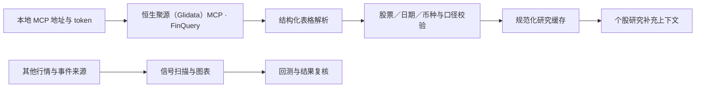

# 恒生聚源（Glidata）MCP 接入说明

恒生聚源（Glidata）MCP 用于补充个股研究数据。通过 FinQuery 查询后，返回的表格会经过字段检查并写入本地缓存，供研究页面读取。

## 接入路径



适配代码位于 `agent/gildata_shadow_service.py`，查询脚本为 `agent/scripts/probe_gildata_shadow.py`。支持市值、估值、目标价、评级，以及按日期读取的可选 VIX 缓存；可用字段取决于服务返回内容。

## 配置

从 agent/.env.example 复制生成本地 agent/.env，并填入自己的配置：

```dotenv
GILDATA_MCP_URL=
GILDATA_MCP_TOKEN=
# 仅在需要时启用按日期匹配的缓存 VIX 回退
GILDATA_VIX_FALLBACK=0
```

MCP 地址须为 HTTPS。服务地址、token 和授权请通过 [恒生聚源数据地图](https://www.gildata.com/products/datamap) 自行获取。公开版本没有预置服务地址或 token，不应在 GitHub 提交自己的 agent/.env、带认证的 URL 或 MCP 客户端私有配置。

在后端 Python 环境中，从仓库根目录执行查询：

```bash
python agent/scripts/probe_gildata_shadow.py --as-of YYYY-MM-DD --symbols AAPL MSFT
```

日期应填写真实的市场交易日。探测一次最多五只股票，会调用外部 MCP 服务；费用按自己的服务授权计。返回样本会写入运行环境的私有缓存，普通页面读取使用已验证缓存，不会自动调用该脚本。

## 数据与许可

- 应用框架源自 [HKUDS/Vibe-Trading](https://github.com/HKUDS/Vibe-Trading)，保留 MIT 许可和上游声明。
- 恒生聚源（Glidata）MCP 是本项目接入的外部研究数据服务，服务本身的源码和商用数据不在本仓库中。
- 信号、图表、回测和模拟还包含其他数据来源；并非每个页面或每个指标都由恒生聚源（Glidata）提供。
- 当前恒生聚源（Glidata）接入用于研究补充和缓存读取，查询样本不直接用于历史校准模型。

各页面介绍见 [完整页面图册](SCREENSHOTS.md)。
