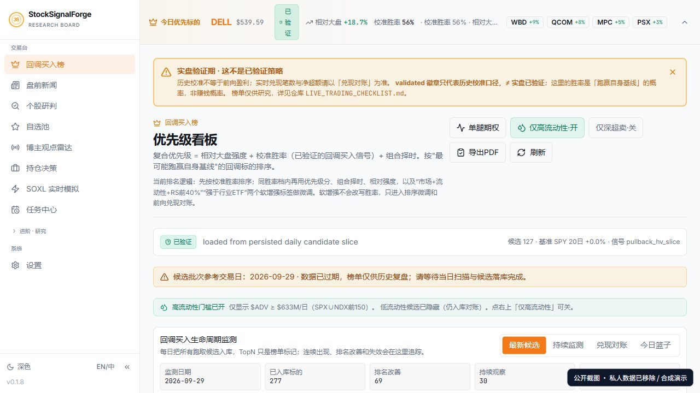
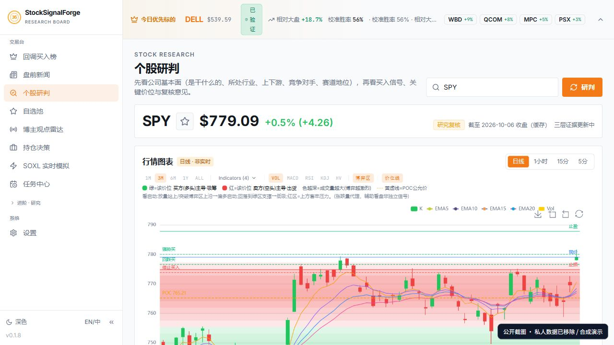

# StockSignalForge · 股讯工坊

**基于 GilData MCP 打造的 AI 股票研究工作台。**

AI 股票分析 · 信号扫描 · 个股研判 · 持仓复盘 · 策略回测

StockSignalForge（股讯工坊）以 GilData MCP（恒生聚源金融数据服务）的研究数据接入为特色，将金融数据查询、研究上下文、图表分析和策略验证组织在一个工作台中。

代码框架源自 [HKUDS/Vibe-Trading](https://github.com/HKUDS/Vibe-Trading)，保留上游 MIT 许可与版权声明。GilData MCP 是本项目接入的外部数据服务；本仓库不包含该服务源码、凭据或商用数据，也不代表 GilData 官方产品。当前 GilData 适配用于显式触发的研究补充与缓存读取，并非全部行情与回测数据的唯一来源。

GilData MCP 服务与授权申请请参见 [恒生聚源数据地图](https://www.gildata.com/products/datamap)。使用者自行配置 MCP 与各数据源 API key。

## 界面预览

[完整页面图册：32 张截图与逐页功能说明](SCREENSHOTS.md) · [GilData MCP 接入说明](GILDATA_MCP.md)

截图来自实际应用，个人信息与配置已移除。行情画面为缓存快照；持仓、回测与相关性示例为合成数据，不是业绩展示。





## 功能地图

| 模块 | 能做什么 |
| --- | --- |
| 交易台 | 回调候选排序、连续监测、预测兑现对账与候选篮子 |
| 个股研究 | 行情图表、公司与赛道背景、研究信号和风险价位 |
| 新闻与观点 | 盘前卡片／清单、观点雷达与事件线索 |
| 自选与持仓 | 管理研究范围、复盘成本和仓位、比较研究建议 |
| 进阶研究 | 启动信号、实股机会、事件雷达、宏观风险与三维汇总 |
| 策略验证 | 因子库与 Bench、回测详情、策略对比和相关性矩阵 |
| 自动化与助手 | 任务中心、研究会话、工具反馈与 MCP 服务 |
| 移动端 | 榜单、新闻、个股、持仓、自选和更多入口 |

### GilData MCP 在项目中的作用

- 调用 GilData MCP 的 FinQuery 接口获取研究补充数据。
- 对返回表格做结构化解析，并检查股票、日期、币种与数据口径。
- 将规范化样本缓存给个股研究上下文使用；普通页面读取不会自动触发 GilData 查询。
- 通过本地环境变量配置地址与 token，公开代码不包含私有 MCP 配置。

GilData 是外部金融数据服务；项目的代码框架、其他行情来源与策略验证能力有各自的来源和实现，详见 [接入说明](GILDATA_MCP.md)。

## 基础能力

- React 前端与 FastAPI 后端，Docker 单容器运行。
- 交易研究、策略回测、个股研判、持仓分析与研究会话。
- GilData MCP FinQuery 接入与数据规范化，以及可选的其他行情来源。
- 对外 MCP 服务，供支持 MCP 的客户端调用。

## 快速启动

需要 Docker Desktop（Linux 容器模式）。在仓库根目录执行：

```powershell
Copy-Item agent/.env.example agent/.env
# 编辑 agent/.env，填写所用模型和数据服务的凭据
docker compose up -d --build vibe-trading
```

打开 [本地网页](http://127.0.0.1:19090)，可用 [健康检查](http://127.0.0.1:19090/health) 验证服务。也可运行 Windows 的 ./start.ps1。

```powershell
docker compose logs --tail 100 vibe-trading
docker compose stop vibe-trading
```

## 私有配置

真实配置只保存在本地，均已加入 .gitignore：

| 配置 | 位置或变量 |
| --- | --- |
| 模型服务 | agent/.env 中的 LANGCHAIN_PROVIDER、LANGCHAIN_MODEL_NAME 和对应 API key |
| GilData MCP | agent/.env 中的 GILDATA_MCP_URL 与 GILDATA_MCP_TOKEN；填写自己的 HTTPS 服务地址和 token |
| 其他数据源 | agent/.env 中对应的 API key/token；按需启用 |
| 外部 MCP 服务 | 默认 ~/.vibe-trading/agent.json；从 config/agent.example.json 的空模板开始配置 |
| MCP 客户端 | config/mcp-client.example.json 仅提供本项目 MCP 服务的无凭据模板 |
| API 访问认证 | agent/.env 中的 API_AUTH_KEY |

未配置 GilData MCP 时，不会自动调用该服务。没有填入真实 key 的示例配置无法运行模型研究或受授权限制的数据查询。GilData 查询由 agent/scripts/probe_gildata_shadow.py 显式触发，可能产生服务费用。

默认网页端口仅绑定本机。公开源码不包含个人数据、历史研究会话、浏览器 cookies、行情数据库、内部维护日志或迁移备份。附带的 daily_stock_analysis 为可选适配代码与补丁，其外部服务镜像和历史数据库由使用者自行提供。

## 开发与许可

Python 3.11+，Node.js 20+。后端开发依赖：pip install -e ".[dev]"；前端在 frontend 目录执行 npm ci 与 npm run dev。开发前端的 API 目标通过 VITE_API_URL 配置。

保留的上游使用说明见 README.upstream.md 与 README_zh.upstream.md。请结合本仓库的配置变更使用，不要沿用他人的服务地址或密钥。Wiki 部署需手动触发，并在 GitHub 配置自己的 Cloudflare secrets 和 CLOUDFLARE_PAGES_PROJECT 变量。

本项目沿用 [MIT License](LICENSE)，第三方声明见 [NOTICE](NOTICE)。本仓库的开源许可不授予第三方数据服务的访问权限或数据再分发授权。
