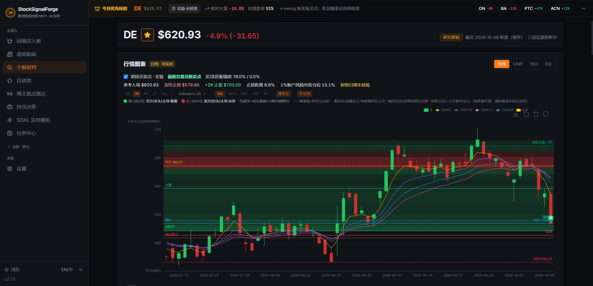
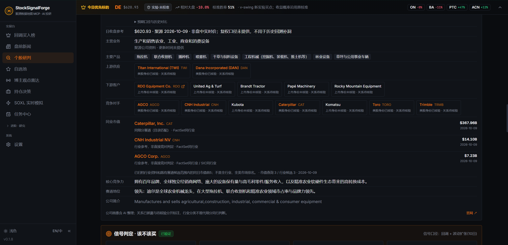

# StockSignalForge 页面图册

**基于恒生聚源（Glidata）MCP 打造的 AI 股票研究工作台。**

从回调榜单到个股研判，再到新闻、自选池和任务中心，下面是各模块的界面与功能。截图中的行情和研究结果为历史快照，移动端持仓为演示数据。

[返回首页](README.md) · [恒生聚源（Glidata）MCP 接入说明](GILDATA_MCP.md)

## 桌面端

### 2026-10-10 新增：波段买卖点与公司关系

用户提供的两张历史快照，保留实验性与关系待核验提示。数据日期、分类匹配强度和收益校准概率是不同口径，不应从截图推导真实账户收益。

#### 实验性波段日线

入口：`/single-stock-overnight?symbol=DE`，开启“波段买卖点 · 实验”。显示新买点、买卖匹配强度、冻结入场/止损、+2R 目标与研究仓位参考；原均线、博弈区和指标保留。

#### 公司关系与同业市值

同页公司介绍显示主营、具体供应商/客户/竞对、身份与关系核验状态，以及有限覆盖范围内的同日行业市值。截图不是全行业排名，行业匹配不等于直接竞争关系。

[更新说明](CHANGELOG.md) · [波段方法与公开配置](wiki/V_SWING_RESEARCH_ZH.md)

| 页面 | 功能 |
| --- | --- |
| [回调买入榜：每日研究入口](#01-priority-overview) | 回调候选、流动性筛选与持续监测 |
| [回调买入榜：校准口径与候选对比](#02-priority-methodology) | 胜率计算说明与候选指标对比 |
| [个股研判：K 线、均线与价位结构](#03-stock-chart) | K 线、均线、技术指标与关键价位 |
| [个股研判：新闻情绪、公司业务与产业链](#04-stock-context) | 新闻情绪、公司业务与产业链 |
| [个股研判：信号判定、隔夜 Alpha 与行动区间](#05-stock-signal) | 回调信号、隔夜统计与盘中复核条件 |
| [个股研判：AI 复核、支持因素与风险](#06-stock-ai-review) | AI 判断依据、反对理由与风险价位 |
| [个股研判：斐波那契参考与相关性证据](#07-stock-evidence) | 回撤参考、历史分位与相关性分析 |
| [盘前新闻：宏观事件卡片与阅读反馈](#08-news-cards) | 新闻摘要、事件影响与阅读反馈 |
| [盘前新闻：筛选清单与跨事件比较](#09-news-list) | 新闻筛选、标签与来源对比 |
| [自选池：研究范围、备注与批量分析](#10-watchlist) | 股票池管理、备注与批量分析 |
| [博主观点雷达：视频摘要与赛道传导](#11-creator-radar) | 视频摘要、个股观点与行业主题 |
| [任务中心：每日扫描进度与运行结果](#12-task-center) | 扫描进度、运行记录与任务恢复 |

### 回调买入榜：每日研究入口

入口：`/`

每天先看这张榜：哪些股票正在回调，哪些相对大盘更强，哪些有足够的流动性。可以筛选高流动性或深超卖标的，也可以查看候选连续出现的天数、排名变化和后续表现。

榜单同时列出优先级、校准胜率、相对强度、波动趋势和择时折扣。校准胜率衡量的是历史样本中扣除成本后跑赢自身基线的概率；“已验证”表示经过历史校准。顶部会提示数据日期和过期状态。

[查看原图](assets/screenshots/desktop/01-priority-overview.png)

### 回调买入榜：校准口径与候选对比

入口：`/`

展开胜率说明，可以看到指标怎么算、排名按什么顺序排。下方将 DELL、WBD、QCOM、MPC 等候选放在同一张表里，对比行业、流动性、相对大盘表现和波动状态。

主胜率采用 pullback_hv 的历史校准结果。流动性、相对强度与行业 ETF 标签只参与排名微调，不会改写胜率。数据来源、回放状态和审计提示也在页面中列出。

[查看原图](assets/screenshots/desktop/02-priority-methodology.png)

### 个股研判：K 线、均线与价位结构

入口：`/single-stock-overnight?symbol=SPY`

输入股票代码，就能查看 K 线、均线和关键价位。这里以 DELL 为例，叠加 EMA、历史买入标记、当前价、回踩区、停止买入线和止损线，方便把信号放回走势中看。

支持日线、小时线和分钟线切换，以及 VOL、MACD、RSI、KDJ、HV 等指标。红绿背景表示买卖主导区域，POC 线标记成交密集价位。报价旁会注明收盘日期和缓存状态。

[查看原图](assets/screenshots/desktop/03-stock-chart.png)

### 个股研判：新闻情绪、公司业务与产业链

入口：`/single-stock-overnight?symbol=SPY`

看价格之前，也要知道公司做什么。公司卡片列出行业、市值、财报日期、主营业务和产品，并整理上游供应商、下游客户、竞争对手及赛道地位。

同页汇总近期新闻、来源和发布时间，按正面、中性、负面标注情绪，并给出短期影响估计。以 Dell 为例，可以一起查看 AI 服务器、存储、网络与 PC 业务的背景。新闻标签和影响值属于模型估计。

[查看原图](assets/screenshots/desktop/04-stock-context.png)

### 个股研判：信号判定、隔夜 Alpha 与行动区间

入口：`/single-stock-overnight?symbol=SPY`

信号区同时展示校准胜率、回调状态、波动变化和相对大盘强度。比如这里的 DELL 正在回调，但波动还未扩张，页面会提示等待进一步确认。

左侧是隔夜 Alpha 统计，包括胜率、平均超额、样本量、Beta 和与 SPY 的走势对比。右侧列出强势确认、回踩买入、停止追高、停止买入、止损和止盈价位。这些条件供盘中复核，不会自动下单；隔夜统计与回调信号分别计算。

[查看原图](assets/screenshots/desktop/05-stock-signal.png)

### 个股研判：AI 复核、支持因素与风险

入口：`/single-stock-overnight?symbol=SPY`

AI 复核会给出判断依据，也会列出反对理由。趋势、相对强度、波动、Gamma、宏观环境和估值等数据都能在支持因素与风险栏中找到，方便检查结论是否有数据支撑。

下方汇总买入触发、停止买入、止损和止盈价位，并解释校准胜率、Beta 等指标的参考范围。模型给出的等待回踩或放弃条件与具体数值一起显示，避免只剩一句看多或看空。

[查看原图](assets/screenshots/desktop/06-stock-ai-review.png)

### 个股研判：斐波那契参考与相关性证据

入口：`/single-stock-overnight?symbol=SPY`

斐波那契表列出摆动高低点、回撤比例和对应价位，用来观察支撑与阻力。页面也会注明历史研究中哪些回撤区间表现较弱，不能把画线位置直接当作买点。

下面的因子卡片展示量能比、短期趋势、距均线位置等指标的当前值、历史分位、相关系数和有效样本数。它们描述当前环境与历史隔夜 Alpha 的关系，相关性本身不代表因果。

[查看原图](assets/screenshots/desktop/07-stock-evidence.png)

### 盘前新闻：宏观事件卡片与阅读反馈

入口：`/premarket-news`

盘前新闻可以一条条翻着看。每张卡片包含中文摘要、媒体来源、发布时间、涉及标的和事件标签；宏观新闻会单独标为全市场事件。

右侧显示冲击分、预计开盘影响和波动带宽，并提供相关指数入口。英文原文与出处可以展开，底部勾选或跳过用于处理阅读队列。顶部还能查看后台刷新状态和最新入库时间。

[查看原图](assets/screenshots/desktop/08-news-cards.png)

### 盘前新闻：筛选清单与跨事件比较

入口：`/premarket-news/list`

想集中筛选新闻，可以切换到清单。支持按时间范围、未读状态和分数过滤，顶部显示队列数量、正负面新闻数量与板块扩散情况，也能手动更新资讯。

每行列出股票代码、新闻要点、事件标签、冲击分、开盘影响、发布时间和来源，便于比较多个事件。行情数据尚未更新的记录会标为“待补齐”。

[查看原图](assets/screenshots/desktop/09-news-list.png)

### 自选池：研究范围、备注与批量分析

入口：`/watchlist`

把自己关注的股票放进自选池，记下关注原因，后续研究就从这份名单开始。支持逐只添加和批量导入，也能直接运行自选池三层分析。

列表汇总现价、涨跌幅、市值、PE、行业、20 日表现、60 日 Alpha、回调或启动状态、GEX 与财报日期。自选池的 Alpha 以纳斯达克／QQQ 为基准；数据补充进度和无信号状态也会显示。

[查看原图](assets/screenshots/desktop/10-watchlist.png)

### 博主观点雷达：视频摘要与赛道传导

入口：`/creator-opinions`

不用逐段翻视频，也能先看看博主讲了什么。观点雷达整理视频摘要、个股倾向和行业主题，同时保留标题、时间、字幕处理状态与 YouTube 原视频链接。

个股观点和赛道传导分开列出，标签区分看多、看空、中性与分歧。可以横向比较不同博主对同一股票的看法，再打开原视频确认上下文。标签代表视频中的观点。

[查看原图](assets/screenshots/desktop/11-creator-radar.png)

### 任务中心：每日扫描进度与运行结果

入口：`/batch-tasks`

每日扫描跑到哪了、上次为什么没完成，都可以在任务中心查看。页面显示股票池进度、计划时间、最近运行结果，以及新闻、事件和 AI 复核的更新状态。

中断后可以接着跑未完成的股票池，也可以强制重跑或恢复榜单。各池的完成与复用情况逐项列出。飞书移动端入口在这里查看隧道状态和访问地址。

[查看原图](assets/screenshots/desktop/12-task-center.png)

## 移动端

### 移动端 · 榜单

入口：`/m`。以手机卡片布局查看研究候选，并进入个股研究。

[查看原图](assets/screenshots/27-mobile-board.jpg)

### 移动端 · 新闻

入口：`/m/news`。在手机布局中阅读盘前资讯和研究线索。

[查看原图](assets/screenshots/28-mobile-news.jpg)

### 移动端 · 个股

入口：`/m/stock?symbol=SPY`。展示个股报价、研究行动区间、风险价位与核心研究信息。

[查看原图](assets/screenshots/29-mobile-stock.jpg)

### 移动端 · 持仓

入口：`/m/portfolio`。以手机布局查看账户摘要、持仓与仓位研究建议。资金与持仓为演示数据。

[查看原图](assets/screenshots/30-mobile-portfolio.jpg)

### 移动端 · 自选

入口：`/m/watchlist`。在手机上维护和查看自选研究范围。

[查看原图](assets/screenshots/31-mobile-watchlist.jpg)

### 移动端 · 更多

入口：`/m/more`。汇总交易台、进阶研究和系统入口，可切换到桌面完整版。

[查看原图](assets/screenshots/32-mobile-more.jpg)

## 全部页面

| 页面 | 路由／入口 | 功能 | 截图 |
| --- | --- | --- | --- |
| 回调买入榜 | `/` | 按回调信号、历史校准口径、相对大盘强度和流动性筛选研究候选；可切换高流动性、深超卖与单腿期权快照。 | [查看](#01-priority-overview) |
| 持续监测 | `/ → 持续监测` | 跟踪候选首次出现、连续观察、排名变化及失效状态，复核信号的生命周期。 | — |
| 兑现对账 | `/ → 兑现对账` | 查看已记录预测的结算、命中口径、净超额、可靠性分桶和排名分桶；区分前向记录与历史回放。 | — |
| 今日篮子 | `/ → 今日篮子` | 以预算、候选数量和权重方式生成候选研究篮子，辅助比较组合分配。 | — |
| 盘前新闻 · 卡片 | `/premarket-news` | 用卡片浏览新闻，查看涉及标的、事件解释与重要性；通过勾叉反馈调整后续新闻偏好。 | [查看](#08-news-cards) |
| 盘前新闻 · 清单 | `/premarket-news/list` | 以列表方式查看盘前资讯，按页面提供的条件筛选与复核新闻上下文。 | [查看](#09-news-list) |
| 个股研判 | `/single-stock-overnight?symbol=SPY` | 汇总公司与赛道背景、价格图表、技术指标、关键行动区间、风险信息和研究复核；可加入自选池。恒生聚源（Glidata）的规范化研究样本可作为补充上下文。 | [查看](#03-stock-chart) |
| 自选池 | `/watchlist` | 单只或批量添加标的、管理启用状态、备注和删除；汇总自选标的的研究指标并触发自选范围复核。 | [查看](#10-watchlist) |
| 博主观点雷达 | `/creator-opinions` | 汇总配置频道的视频记录、观点、股票标签与赛道信号，将非结构化观点纳入研究观察。 | [查看](#11-creator-radar) |
| 持仓决策 | `/portfolio` | 录入持仓、成本与可用现金，查看持仓权重、浮动盈亏、加仓／持有／减仓／平仓研究建议和风险价位。 | — |
| SOXL 实时模拟 | `/soxl-quant` | 展示实时行情连接状态、模拟账户、信号、成交与权益曲线，以及训练／验证／测试分段回测入口。 | — |
| 任务中心 | `/batch-tasks` | 查看定时扫描、批处理进度、榜单快照、样本外采集和校准曲线状态；配置后的移动访问地址也在这里展示。 | [查看](#12-task-center) |
| 启动信号 | `/launch-signal` | 配置研究股票池与筛选参数，查看量化启动信号排名和历史影响校准入口。 | — |
| 实股信号 | `/stock-signals` | 通过实股机会筛选工具浏览机会观察清单，查看信号详情与研究解释。 | — |
| 事件雷达 | `/event-radar` | 围绕统一股票池查看短期启动事件、扫描参数、历史影响校准及排名。 | — |
| 宏观恐慌雷达 | `/macro-panic-radar` | 查看 VIX／可用代理指标、市场恐慌状态、系统性危机过滤和计算来源说明。 | — |
| 三维信号汇总 | `/signal-dashboard` | 将多个研究维度汇总到统一表格，结合历史验证、研究概率、风险收益与可执行性完成复核。 | — |
| 隔夜驾驶舱 | `/overnight-cockpit` | 围绕尾盘到次日开盘的研究场景，比较指数池候选、基准、隔夜信息和风险上下文。 | — |
| Alpha 因子库 | `/alpha-zoo` | 浏览 Qlib 158、Kakushadze 101、GTJA 191 与 Academic 四类预置因子；可按库、主题与股票池筛选。 | — |
| Alpha 因子详情 | `/alpha-zoo/academic_carhart_mom` | 展示单因子的公式、主题、适用股票池、频率、预热要求、备注与源码入口。 | — |
| Alpha Bench | `/alpha-zoo/bench` | 配置因子库、股票池与时间区间，运行批量评估并查看进度和结果。 | — |
| 研究助手 | `/agent` | 用自然语言发起研究，查看工具执行反馈、会话与研究产物；模型与 MCP 工具需自行配置。 | — |
| 回测运行详情 | `/runs/:runId` | 查看运行状态、权益与回撤、指标、交易记录、策略代码、报告和可用验证产物。 | — |
| 策略对比 | `/compare` | 选择两次运行，对比权益与回撤曲线及关键回测指标。 | — |
| 相关性矩阵 | `/correlation` | 输入多资产代码、窗口期与 Pearson／Spearman 方法，展示相关性矩阵。 | — |
| 设置 | `/settings` | 配置本地 API 认证、模型提供商、模型名、生成参数与可选行情数据源。恒生聚源（Glidata）MCP 地址和 token 当前通过本地 agent/.env 配置。 | — |
| 移动端 · 榜单 | `/m` | 以手机卡片布局查看研究候选，并进入个股研究。 | [查看](#27-mobile-board) |
| 移动端 · 新闻 | `/m/news` | 在手机布局中阅读盘前资讯和研究线索。 | [查看](#28-mobile-news) |
| 移动端 · 个股 | `/m/stock?symbol=SPY` | 展示个股报价、研究行动区间、风险价位与核心研究信息。 | [查看](#29-mobile-stock) |
| 移动端 · 持仓 | `/m/portfolio` | 以手机布局查看账户摘要、持仓与仓位研究建议。 | [查看](#30-mobile-portfolio) |
| 移动端 · 自选 | `/m/watchlist` | 在手机上维护和查看自选研究范围。 | [查看](#31-mobile-watchlist) |
| 移动端 · 更多 | `/m/more` | 汇总交易台、进阶研究和系统入口，可切换到桌面完整版。 | [查看](#32-mobile-more) |
