# StockSignalForge 页面图册

**基于 GilData MCP 打造的 AI 股票研究工作台。**

图册覆盖当前全部桌面与移动端应用路由，并额外展示看板的持续监测、兑现对账与今日篮子标签页。截图拍摄于 2026-10-07，来自实际应用界面。行情与研究页为静态缓存快照，日期以画面内标注为准；账户、回测和相关性示例为合成数据。密钥、私有地址、个人自选、关注记录和研究会话未公开。空状态表示截图环境未配置或未提供数据，不表示真实运行结果。

GilData MCP 是金融研究数据接入能力的组成部分：当前代码通过 FinQuery 获取明确触发的研究样本，校验标的、日期、币种等字段后供缓存读取和个股研究使用。截图中的所有指标并非都来自 GilData；行情、回测、宏观与模拟模块也包含其他来源。

## 页面索引

| 页面 | 路由／入口 | 主要用途 |
| --- | --- | --- |
| [回调买入榜](#01-priority-board) | `/` | 开始每日研究，先建立候选清单。 |
| [持续监测](#02-priority-monitor) | `/ → 持续监测` | 关注候选随时间的变化，而不只看单日排名。 |
| [兑现对账](#03-priority-scorecard) | `/ → 兑现对账` | 检查研究信号与后续结果是否一致。 |
| [今日篮子](#26-priority-basket) | `/ → 今日篮子` | 从候选列表过渡到组合研究。 |
| [盘前新闻 · 卡片](#04-news-swipe) | `/premarket-news` | 快速进行盘前阅读。 |
| [盘前新闻 · 清单](#05-news-list) | `/premarket-news/list` | 集中检索和比较新闻事件。 |
| [个股研判](#06-single-stock) | `/single-stock-overnight?symbol=SPY` | 深入分析某个候选，连接数据、图表与研究解释。 |
| [自选池](#07-watchlist) | `/watchlist` | 维护自己的研究范围。公开截图移除了个人自选。 |
| [博主观点雷达](#08-creator-radar) | `/creator-opinions` | 比较媒体观点与其他研究线索。公开截图移除了个人关注记录。 |
| [持仓决策](#09-portfolio) | `/portfolio` | 复盘组合和仓位管理。截图内资金与持仓全部为合成数据。 |
| [SOXL 实时模拟](#10-soxl-paper) | `/soxl-quant` | 研究 SOXL 的行情驱动模拟；不会发送实盘券商订单。截图未连接实时行情。 |
| [任务中心](#11-task-center) | `/batch-tasks` | 检查每日研究任务与数据准备状态。私有访问地址不公开。 |
| [启动信号](#12-launch-signal) | `/launch-signal` | 探索原始信号，辅助后续验证。 |
| [实股信号](#13-stock-signals) | `/stock-signals` | 集中观察股票信号；结果依赖对应数据源与研究口径。 |
| [事件雷达](#14-event-radar) | `/event-radar` | 把新闻和事件线索与价格研究结合。 |
| [宏观恐慌雷达](#15-macro-panic) | `/macro-panic-radar` | 为个股研究补充宏观风险环境；代理指标与官方 VIX 会分开标注。 |
| [三维信号汇总](#16-signal-dashboard) | `/signal-dashboard` | 跨模块比较同一批候选。 |
| [隔夜驾驶舱](#17-overnight-cockpit) | `/overnight-cockpit` | 研究隔夜策略与所属指数的相对表现。 |
| [Alpha 因子库](#18-alpha-library) | `/alpha-zoo` | 寻找因子研究起点。 |
| [Alpha 因子详情](#19-alpha-detail) | `/alpha-zoo/academic_carhart_mom` | 审查因子定义和实现，再决定是否评估。 |
| [Alpha Bench](#20-alpha-benchmark) | `/alpha-zoo/bench` | 在自己的数据和范围上验证因子；截图没有触发真实评估。 |
| [研究助手](#21-research-agent) | `/agent` | 从问题出发组织研究流程。当前默认导航隐藏该入口，但路由仍可直接访问。 |
| [回测运行详情](#22-backtest-detail) | `/runs/:runId` | 复核一次策略运行的过程和结果。截图使用合成演示运行，非真实业绩。 |
| [策略对比](#23-strategy-compare) | `/compare` | 比较策略、参数或研究方案。截图的两次运行均为合成演示。 |
| [相关性矩阵](#24-correlation) | `/correlation` | 观察资产关系与分散程度。截图矩阵使用合成数据。 |
| [设置](#25-settings) | `/settings` | 连接自己的服务。截图不含密钥、地址或密钥提示片段。 |
| [移动端 · 榜单](#27-mobile-board) | `/m` | 在移动设备上快速浏览榜单。 |
| [移动端 · 新闻](#28-mobile-news) | `/m/news` | 碎片时间浏览新闻。 |
| [移动端 · 个股](#29-mobile-stock) | `/m/stock?symbol=SPY` | 移动端复核某只股票。 |
| [移动端 · 持仓](#30-mobile-portfolio) | `/m/portfolio` | 移动端复盘持仓。资金与持仓仍为合成演示。 |
| [移动端 · 自选](#31-mobile-watchlist) | `/m/watchlist` | 快速管理关注标的。个人自选未公开。 |
| [移动端 · 更多](#32-mobile-more) | `/m/more` | 查找完整功能；部分进阶工具沿用桌面布局。 |

## 截图与功能说明

### 回调买入榜

入口：`/`。按回调信号、历史校准口径、相对大盘强度和流动性筛选研究候选；可切换高流动性、深超卖与单腿期权快照。

开始每日研究，先建立候选清单。

### 持续监测

入口：`/ → 持续监测`。跟踪候选首次出现、连续观察、排名变化及失效状态，复核信号的生命周期。

关注候选随时间的变化，而不只看单日排名。

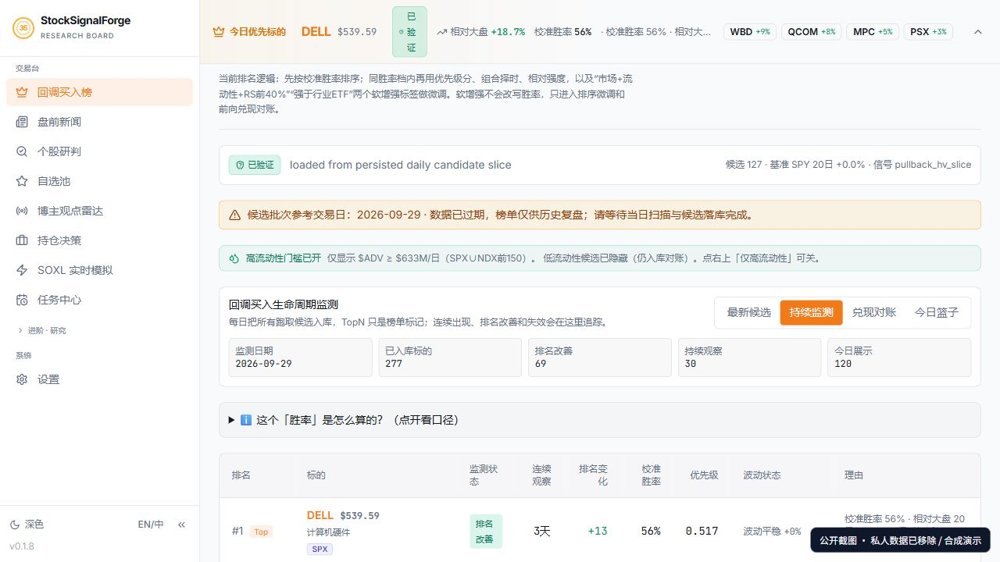

### 兑现对账

入口：`/ → 兑现对账`。查看已记录预测的结算、命中口径、净超额、可靠性分桶和排名分桶；区分前向记录与历史回放。

检查研究信号与后续结果是否一致。

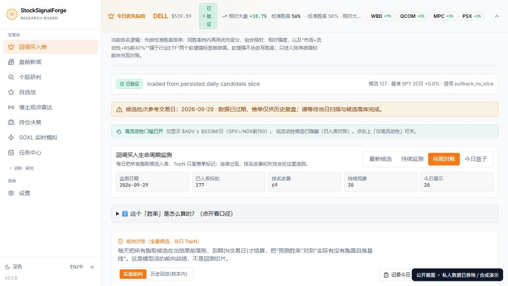

### 今日篮子

入口：`/ → 今日篮子`。以预算、候选数量和权重方式生成候选研究篮子，辅助比较组合分配。

从候选列表过渡到组合研究。

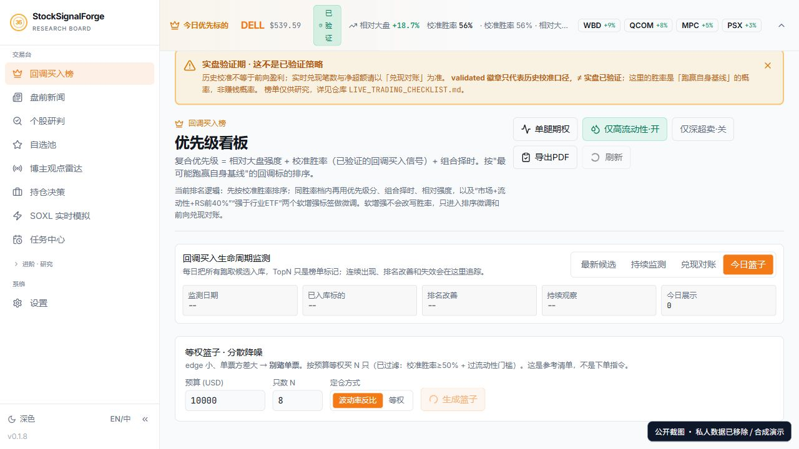

### 盘前新闻 · 卡片

入口：`/premarket-news`。用卡片浏览新闻，查看涉及标的、事件解释与重要性；通过勾叉反馈调整后续新闻偏好。

快速进行盘前阅读。

### 盘前新闻 · 清单

入口：`/premarket-news/list`。以列表方式查看盘前资讯，按页面提供的条件筛选与复核新闻上下文。

集中检索和比较新闻事件。

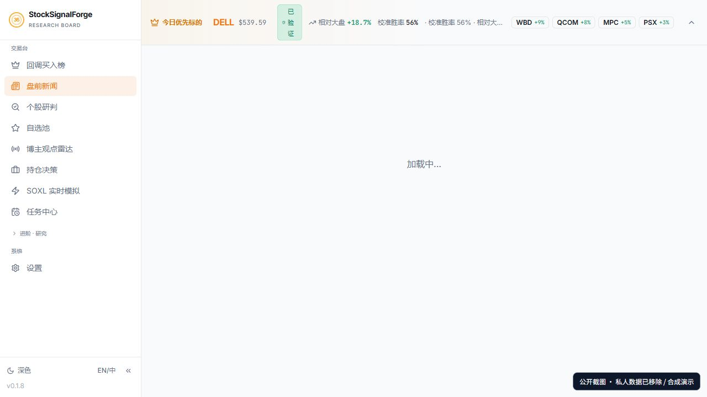

### 个股研判

入口：`/single-stock-overnight?symbol=SPY`。汇总公司与赛道背景、价格图表、技术指标、关键行动区间、风险信息和研究复核；可加入自选池。GilData 的规范化研究样本可作为补充上下文。

深入分析某个候选，连接数据、图表与研究解释。

### 自选池

入口：`/watchlist`。单只或批量添加标的、管理启用状态、备注和删除；汇总自选标的的研究指标并触发自选范围复核。

维护自己的研究范围。公开截图移除了个人自选。

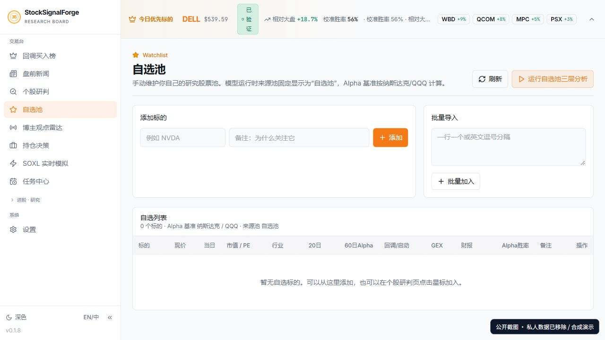

### 博主观点雷达

入口：`/creator-opinions`。汇总配置频道的视频记录、观点、股票标签与赛道信号，将非结构化观点纳入研究观察。

比较媒体观点与其他研究线索。公开截图移除了个人关注记录。

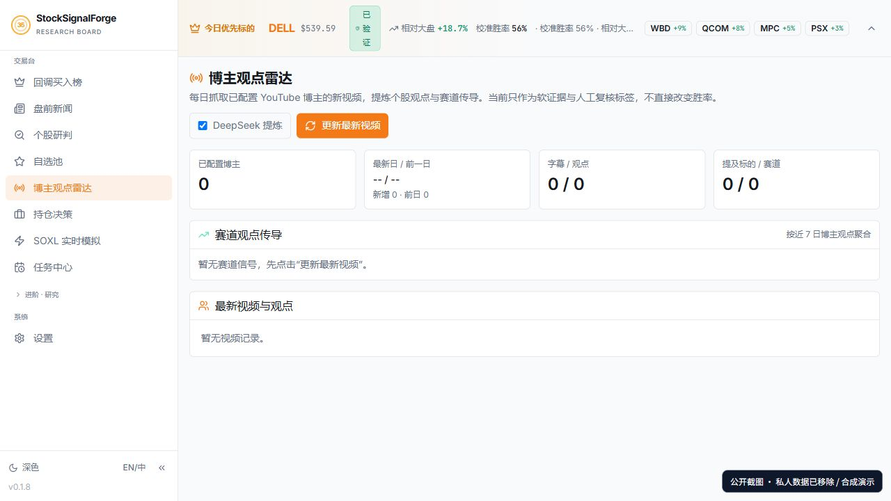

### 持仓决策

入口：`/portfolio`。录入持仓、成本与可用现金，查看持仓权重、浮动盈亏、加仓／持有／减仓／平仓研究建议和风险价位。

复盘组合和仓位管理。截图内资金与持仓全部为合成数据。

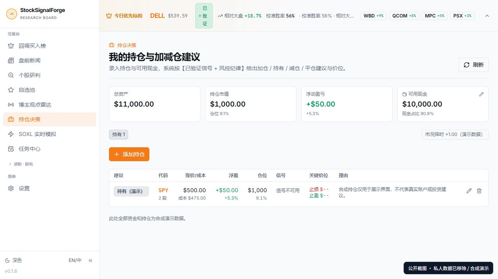

### SOXL 实时模拟

入口：`/soxl-quant`。展示实时行情连接状态、模拟账户、信号、成交与权益曲线，以及训练／验证／测试分段回测入口。

研究 SOXL 的行情驱动模拟；不会发送实盘券商订单。截图未连接实时行情。

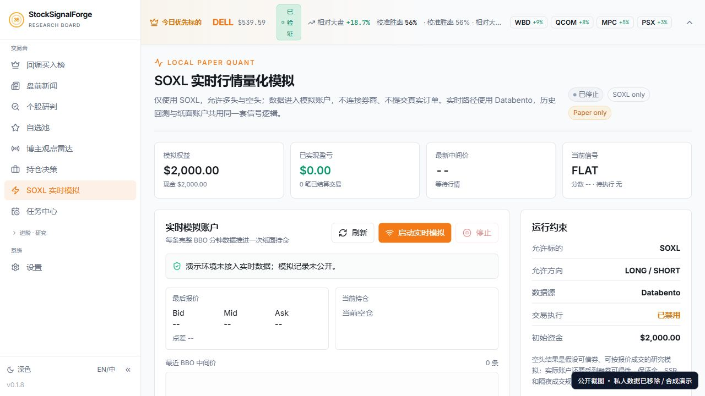

### 任务中心

入口：`/batch-tasks`。查看定时扫描、批处理进度、榜单快照、样本外采集和校准曲线状态；配置后的移动访问地址也在这里展示。

检查每日研究任务与数据准备状态。私有访问地址不公开。

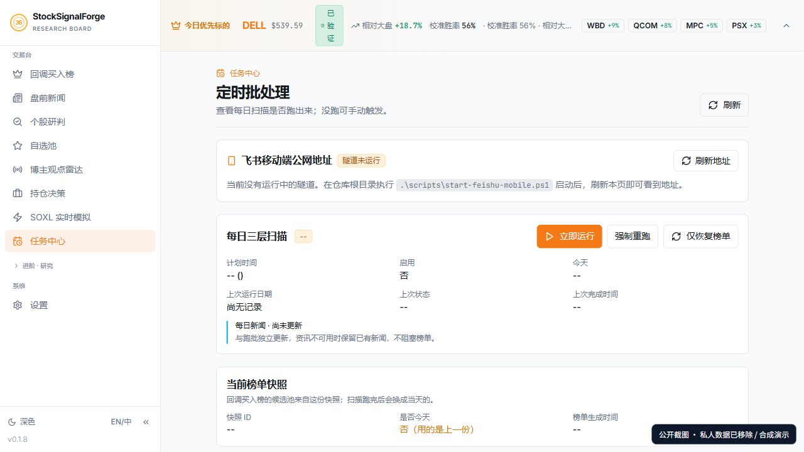

### 启动信号

入口：`/launch-signal`。配置研究股票池与筛选参数，查看量化启动信号排名和历史影响校准入口。

探索原始信号，辅助后续验证。

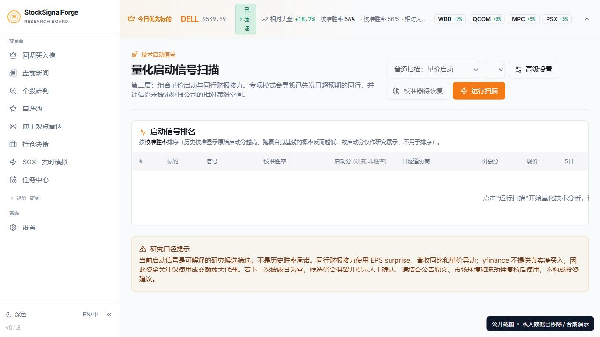

### 实股信号

入口：`/stock-signals`。通过实股机会筛选工具浏览机会观察清单，查看信号详情与研究解释。

集中观察股票信号；结果依赖对应数据源与研究口径。

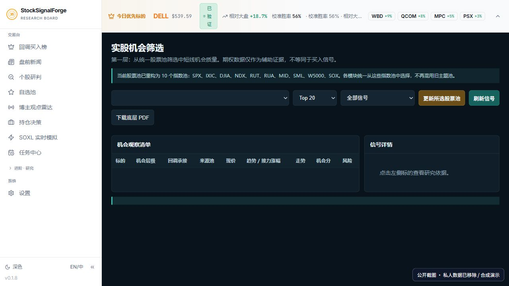

### 事件雷达

入口：`/event-radar`。围绕统一股票池查看短期启动事件、扫描参数、历史影响校准及排名。

把新闻和事件线索与价格研究结合。

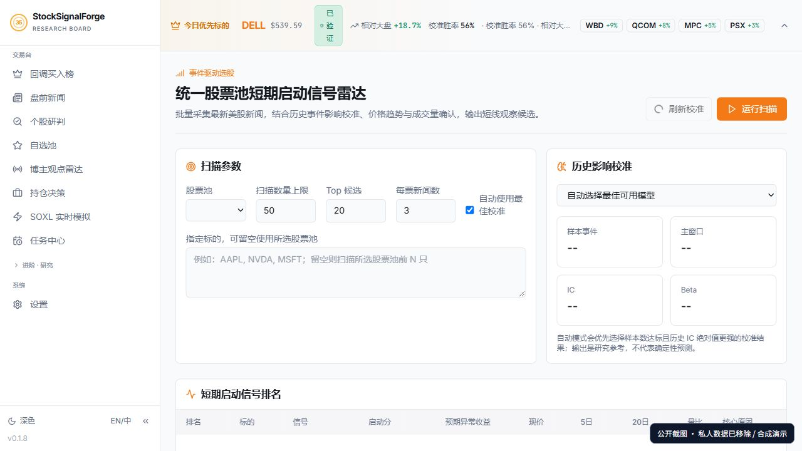

### 宏观恐慌雷达

入口：`/macro-panic-radar`。查看 VIX／可用代理指标、市场恐慌状态、系统性危机过滤和计算来源说明。

为个股研究补充宏观风险环境；代理指标与官方 VIX 会分开标注。

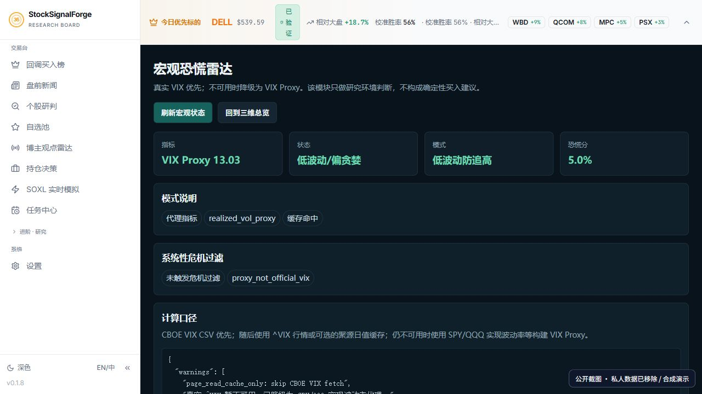

### 三维信号汇总

入口：`/signal-dashboard`。将多个研究维度汇总到统一表格，结合历史验证、研究概率、风险收益与可执行性完成复核。

跨模块比较同一批候选。

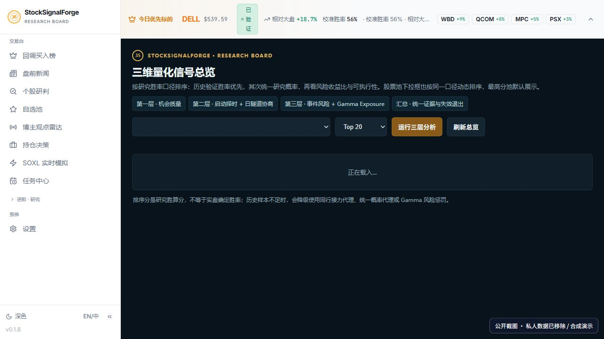

### 隔夜驾驶舱

入口：`/overnight-cockpit`。围绕尾盘到次日开盘的研究场景，比较指数池候选、基准、隔夜信息和风险上下文。

研究隔夜策略与所属指数的相对表现。

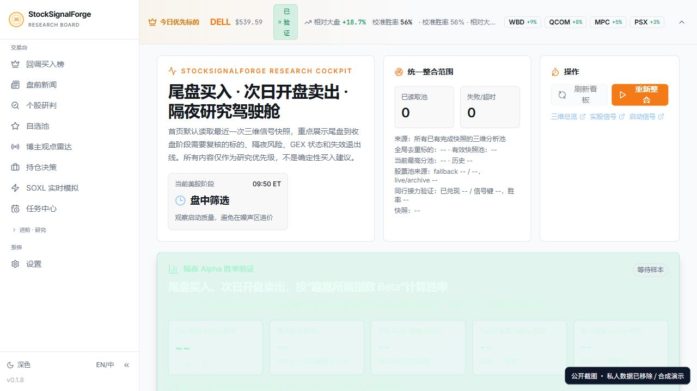

### Alpha 因子库

入口：`/alpha-zoo`。浏览 Qlib 158、Kakushadze 101、GTJA 191 与 Academic 四类预置因子；可按库、主题与股票池筛选。

寻找因子研究起点。

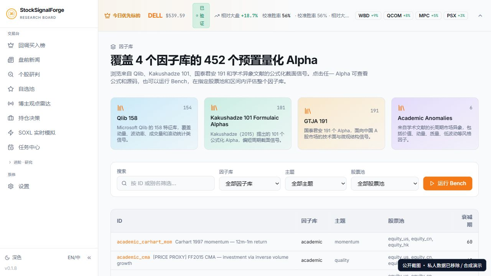

### Alpha 因子详情

入口：`/alpha-zoo/academic_carhart_mom`。展示单因子的公式、主题、适用股票池、频率、预热要求、备注与源码入口。

审查因子定义和实现，再决定是否评估。

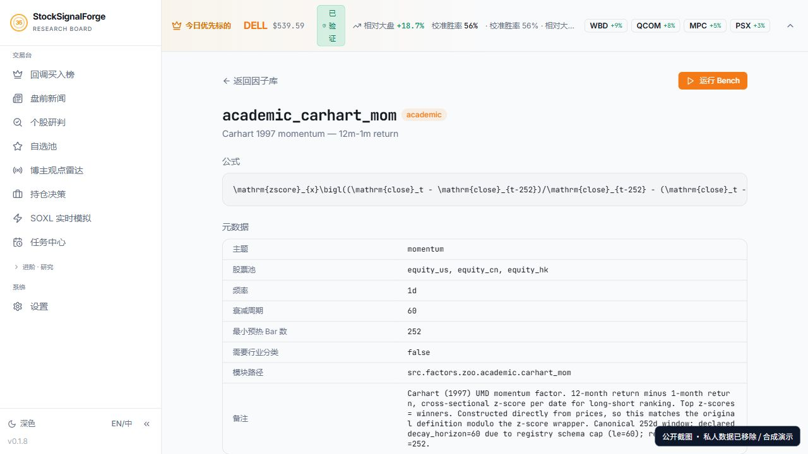

### Alpha Bench

入口：`/alpha-zoo/bench`。配置因子库、股票池与时间区间，运行批量评估并查看进度和结果。

在自己的数据和范围上验证因子；截图没有触发真实评估。

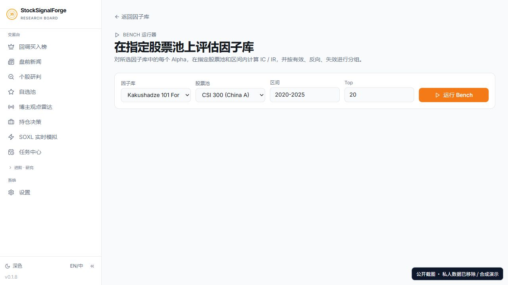

### 研究助手

入口：`/agent`。用自然语言发起研究，查看工具执行反馈、会话与研究产物；模型与 MCP 工具由使用者配置。

从问题出发组织研究流程。当前默认导航隐藏该入口，但路由仍可直接访问。

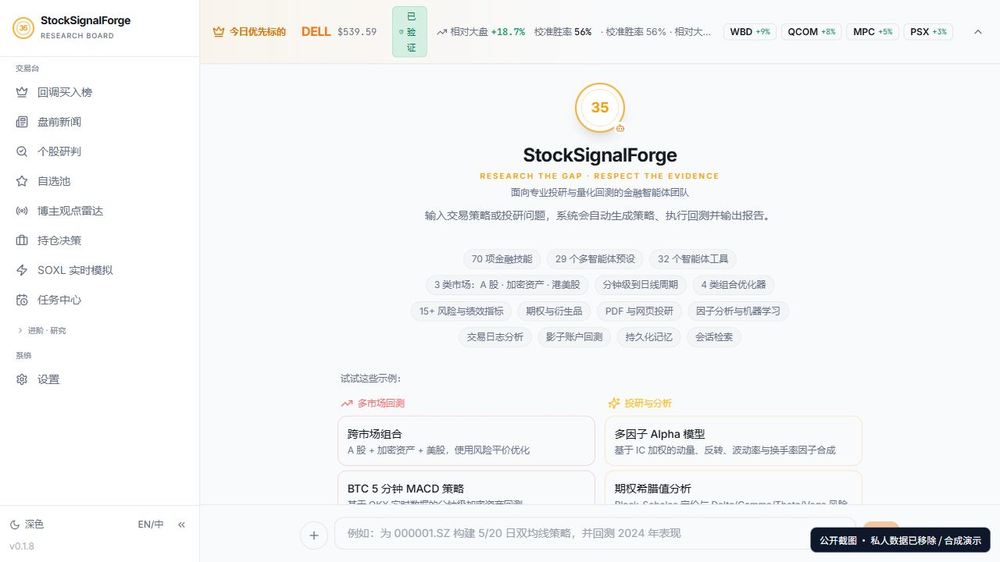

### 回测运行详情

入口：`/runs/:runId`。查看运行状态、权益与回撤、指标、交易记录、策略代码、报告和可用验证产物。

复核一次策略运行的过程和结果。截图使用合成演示运行，非真实业绩。

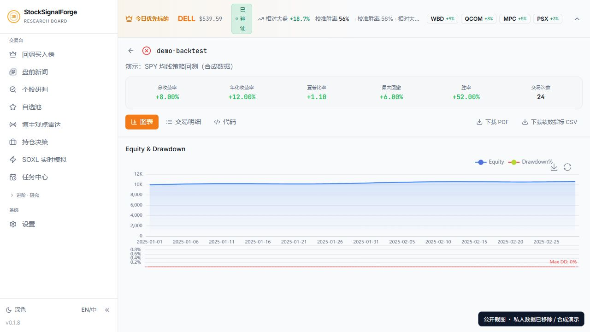

### 策略对比

入口：`/compare`。选择两次运行，对比权益与回撤曲线及关键回测指标。

比较策略、参数或研究方案。截图的两次运行均为合成演示。

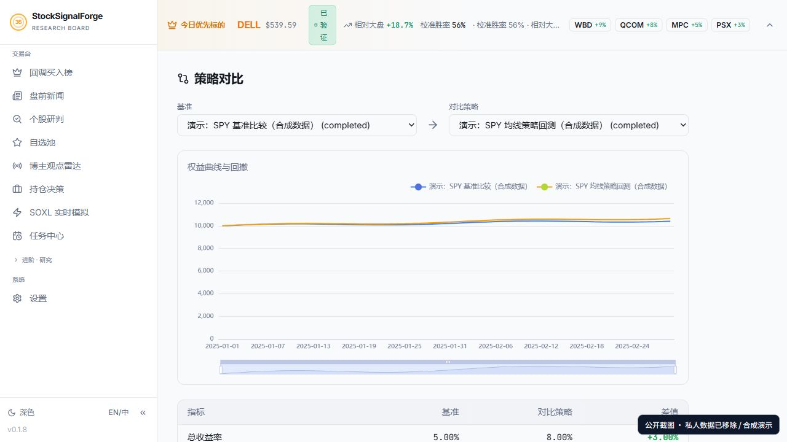

### 相关性矩阵

入口：`/correlation`。输入多资产代码、窗口期与 Pearson／Spearman 方法，展示相关性矩阵。

观察资产关系与分散程度。截图矩阵使用合成数据。

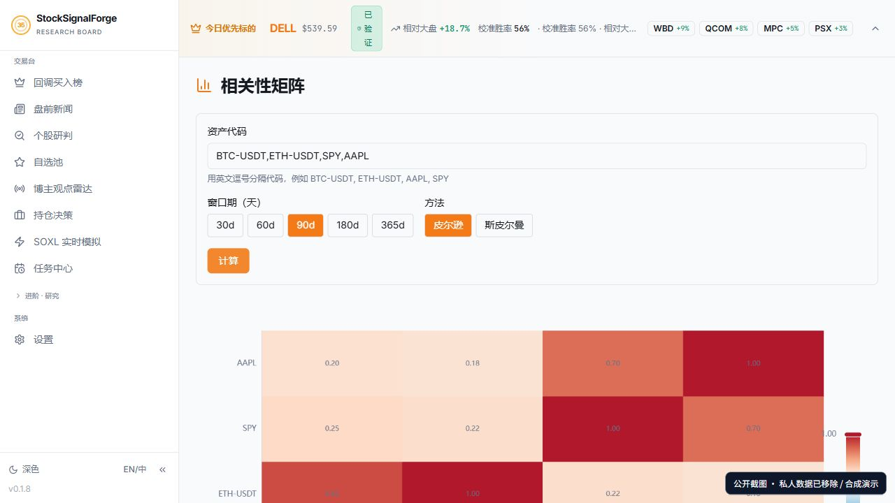

### 设置

入口：`/settings`。配置本地 API 认证、模型提供商、模型名、生成参数与可选行情数据源。GilData MCP 地址和 token 当前通过本地 agent/.env 配置。

连接自己的服务。截图不含密钥、地址或密钥提示片段。

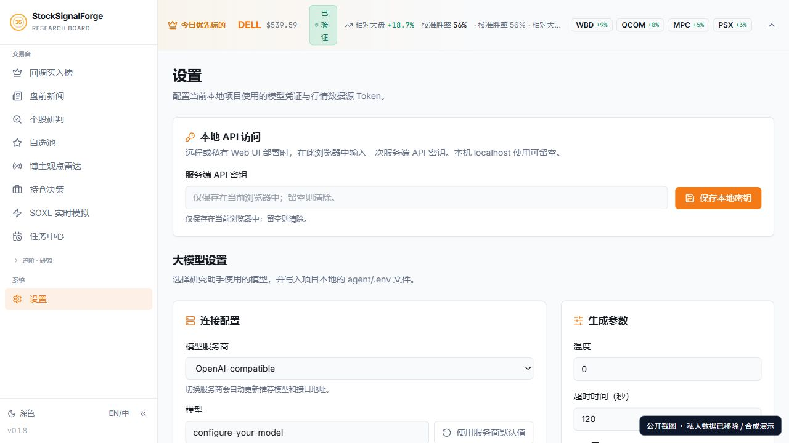

### 移动端 · 榜单

入口：`/m`。以手机卡片布局查看研究候选，并进入个股研究。

在移动设备上快速浏览榜单。

### 移动端 · 新闻

入口：`/m/news`。在手机布局中阅读盘前资讯和研究线索。

碎片时间浏览新闻。

### 移动端 · 个股

入口：`/m/stock?symbol=SPY`。展示个股报价、研究行动区间、风险价位与核心研究信息。

移动端复核某只股票。

### 移动端 · 持仓

入口：`/m/portfolio`。以手机布局查看账户摘要、持仓与仓位研究建议。

移动端复盘持仓。资金与持仓仍为合成演示。

### 移动端 · 自选

入口：`/m/watchlist`。在手机上维护和查看自选研究范围。

快速管理关注标的。个人自选未公开。

### 移动端 · 更多

入口：`/m/more`。汇总交易台、进阶研究和系统入口，可切换到桌面完整版。

查找完整功能；部分进阶工具沿用桌面布局。

