# StockSignalForge 完整页面图册

**基于 GilData MCP 打造的 AI 股票研究工作台。**

桌面端采用使用者提供的 12 张深色主题原图，原始 PNG 未裁切、重采样或改写，点击图片下方链接可查看原图。截图保留实际部署中的 easymoneysniper 名称；开源仓库名称为 StockSignalForge。画面里的报价、日期、研究指标与任务状态属于各自的历史快照，不代表当前行情。使用者选择公开的自选备注与博主观点在这些截图中保留；源码中的私有 MCP 地址、API key 与运行数据库仍不随仓库发布。移动端沿用已有 6 张截图，其中持仓为合成演示数据。

GilData MCP 是本项目的金融研究数据接入特色：当前代码显式调用 FinQuery 获取研究补充数据，检查标的、日期、币种与口径后用于缓存和个股研究上下文。图中行情、信号、AI 解释及其他指标还涉及其他数据源与模块，具体边界见 [GilData MCP 接入说明](GILDATA_MCP.md)。

本图册收录 12 张桌面原图与 6 张移动端截图，并保留完整的页面与标签入口索引。未提供对应桌面原图的页面仍列出功能说明，便于了解应用范围。

## 桌面截图索引

| 截图 | 展示内容 |
| --- | --- |
| [回调买入榜：每日研究入口](#01-priority-overview) | 从回调候选开始建立研究清单。 |
| [回调买入榜：校准口径与候选对比](#02-priority-methodology) | 展开胜率说明后，页面将研究假设与排序结果放在一起：先说明校准目标、成本扣除和基线，再展示 DELL、WBD、QCOM、MPC 等候选的指标与标签，方便横向比较同一批次中的研究对象。 |
| [个股研判：K 线、均线与价位结构](#03-stock-chart) | 输入股票代码后，在同一页面查看报价、缓存截止日期与行情图表。 |
| [个股研判：新闻情绪、公司业务与产业链](#04-stock-context) | 将价格研究与公司背景放在一起。 |
| [个股研判：信号判定、隔夜 Alpha 与行动区间](#05-stock-signal) | 把研究信号拆成可检查的条件：校准胜率、回调状态、波动变化和相对大盘强度集中显示。 |
| [个股研判：AI 复核、支持因素与风险](#06-stock-ai-review) | AI 复核将模型结论展开为支持因素与反对因素，保留原始指标字段供追溯。 |
| [个股研判：斐波那契参考与相关性证据](#07-stock-evidence) | 展示研究结论背后的辅助证据。 |
| [盘前新闻：宏观事件卡片与阅读反馈](#08-news-cards) | 通过卡片逐条阅读盘前资讯。 |
| [盘前新闻：筛选清单与跨事件比较](#09-news-list) | 以清单集中比较宏观与个股新闻，支持时间范围、未读状态和分数筛选，并提供手动更新入口。 |
| [自选池：研究范围、备注与批量分析](#10-watchlist) | 维护个人研究股票池，支持单只添加、填写关注原因和批量导入，并提供自选池三层分析入口。 |
| [博主观点雷达：视频摘要与赛道传导](#11-creator-radar) | 把长视频观点整理为可浏览的研究线索。 |
| [任务中心：每日扫描进度与运行结果](#12-task-center) | 查看每日三层扫描是否完成、当前处理进度、计划时间、启用状态和最近运行结果。 |

## 桌面功能展示

### 回调买入榜：每日研究入口

入口：`/`

从回调候选开始建立研究清单。顶部集中展示优先标的和相关候选，主体显示榜单口径、数据状态、高流动性过滤、生命周期监测及候选统计，让读者先了解数据是否准备完成，再比较研究对象。

画面中的优先级、校准胜率、相对大盘强度、波动趋势和择时折扣分别承担不同角色。校准胜率指历史口径下扣除成本后跑赢标的自身基线的概率；“已验证”标记与历史校准有关。截图明确提示候选批次已过期，并保留实盘验证期提醒，阅读时应先核对交易日与数据来源。

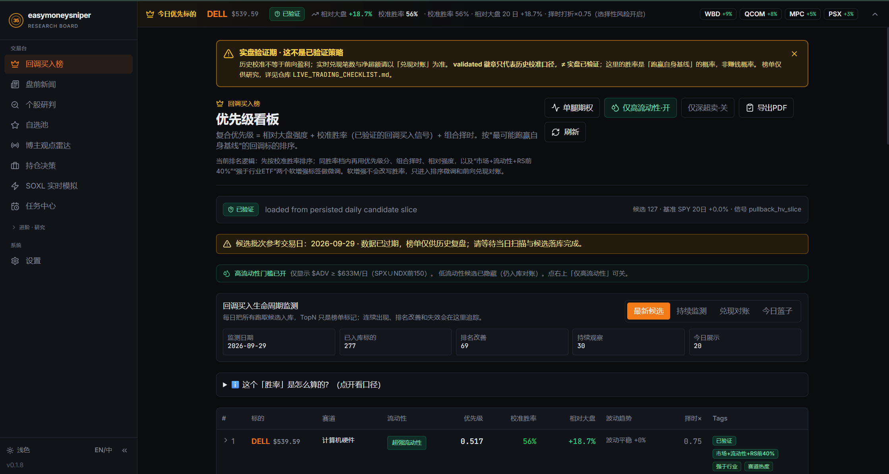

[查看完整原图](assets/screenshots/desktop/01-priority-overview.png)

### 回调买入榜：校准口径与候选对比

入口：`/`

展开胜率说明后，页面将研究假设与排序结果放在一起：先说明校准目标、成本扣除和基线，再展示 DELL、WBD、QCOM、MPC 等候选的指标与标签，方便横向比较同一批次中的研究对象。

主胜率来自 pullback_hv 历史校准；市场流动性、相对强度与行业 ETF 标签用于排序微调和前向对账。表格同时显示行业、流动性、优先级、相对大盘表现与波动状态；来源审计状态和 replay 标记保留在原图中，便于理解证据的适用范围。

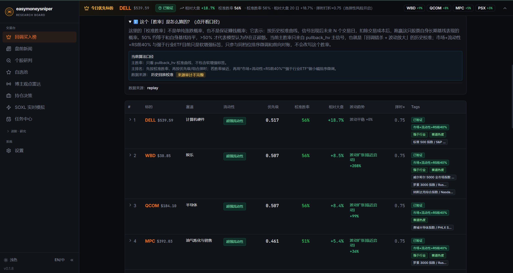

[查看完整原图](assets/screenshots/desktop/02-priority-methodology.png)

### 个股研判：K 线、均线与价位结构

入口：`/single-stock-overnight?symbol=SPY`

输入股票代码后，在同一页面查看报价、缓存截止日期与行情图表。截图以 DELL 为例，展示三个月日线、EMA 均线、历史买入标记、成交量相关开关，以及买入、停止买入、止损和当前价等价位线。

图表支持时间范围和周期切换，提供 VOL、MACD、RSI、KDJ、HV 等指标入口。绿色与红色背景带解释买卖主导区域，POC 线用于观察成交密集价位；这些图层可作为结构复核线索。画面标注“日线·非实时”和缓存收盘日期，BLOCK OPEN 状态也一并保留。

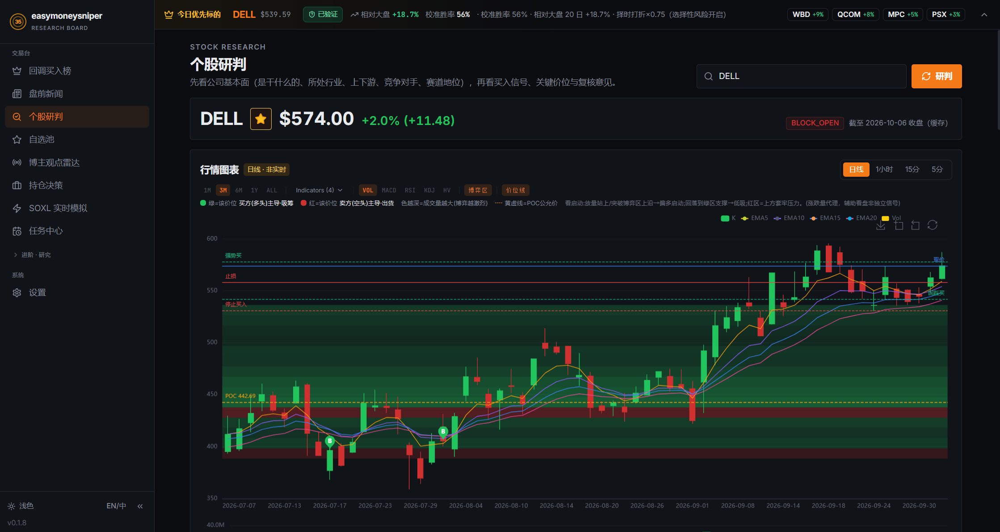

[查看完整原图](assets/screenshots/desktop/03-stock-chart.png)

### 个股研判：新闻情绪、公司业务与产业链

入口：`/single-stock-overnight?symbol=SPY`

将价格研究与公司背景放在一起。上方汇总近期新闻的正面、中性、负面标签、短期影响估计和原始来源；下方展示 Dell 的行业分类、市值、财报时间、主营业务与主要产品，帮助读者先理解公司靠什么经营。

公司卡片进一步列出上游供应商、下游客户、竞争对手、核心竞争力和赛道地位，适合梳理产业链与研究问题。新闻情绪是启发式标注，画面中的影响值也有估计口径；公司资料与新闻各自显示来源和日期，应与最新披露交叉核对。

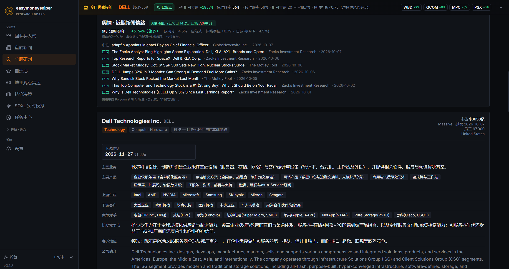

[查看完整原图](assets/screenshots/desktop/04-stock-context.png)

### 个股研判：信号判定、隔夜 Alpha 与行动区间

入口：`/single-stock-overnight?symbol=SPY`

把研究信号拆成可检查的条件：校准胜率、回调状态、波动变化和相对大盘强度集中显示。截图保留“处于回调区，但波动尚未扩张”的解释，读者可以看到当前条件与进一步确认条件之间的关系。

左侧独立展示隔夜 Alpha 胜率、强隔夜胜率、平均超额、样本量和 Beta，并用归一化曲线比较标的与 SPY。右侧列出强势确认、回踩复核、停止追高、停止买入及止损止盈价位，用于盘中人工复核。隔夜口径与回调口径分开标注，画面也说明行动区间不构成自动下单指令。

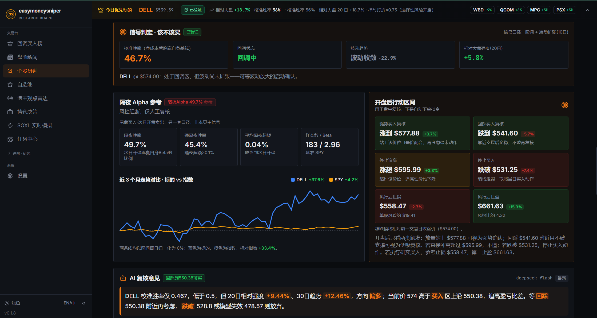

[查看完整原图](assets/screenshots/desktop/05-stock-signal.png)

### 个股研判：AI 复核、支持因素与风险

入口：`/single-stock-overnight?symbol=SPY`

AI 复核将模型结论展开为支持因素与反对因素，保留原始指标字段供追溯。截图同时列出趋势与相对强度、波动和 Gamma 环境、宏观代理及估值信息，并说明当前价格、校准胜率与买入区间之间存在的约束。

关注价位卡片汇总强势触发、回踩触发、停止买入、止损与止盈位置；下方指标对照解释校准胜率和 Beta 的参考范围。模型名、风险因素和限制条件都保留在画面中，方便把生成解释与结构化数据逐项核对；应结合条件和数据日期阅读整个结论。

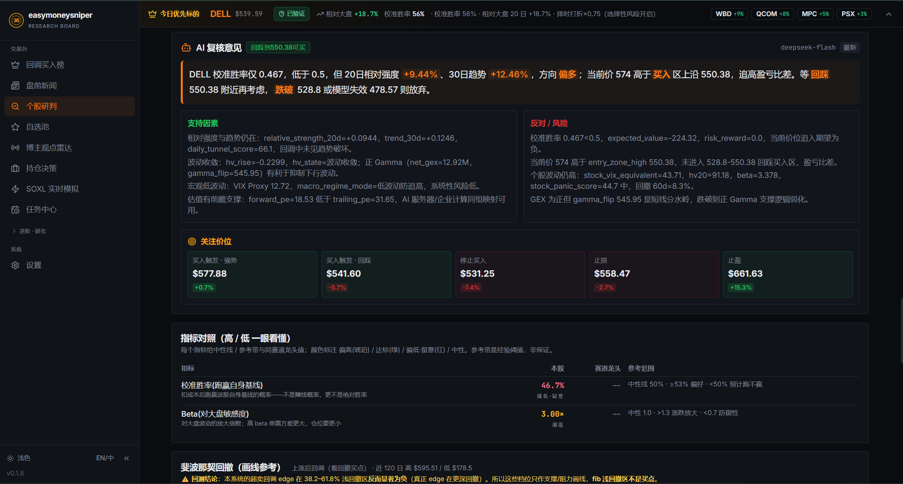

[查看完整原图](assets/screenshots/desktop/06-stock-ai-review.png)

### 个股研判：斐波那契参考与相关性证据

入口：`/single-stock-overnight?symbol=SPY`

展示研究结论背后的辅助证据。斐波那契区间列出摆动高低点、回撤比例与对应价位，明确提示浅回撤区域在当前历史研究中的超额表现偏弱，帮助读者理解支撑阻力画线与实证信号之间的区别。

下方按与隔夜 Alpha 的相关性展示量能比、短期趋势、距均线位置等因子，并给出当前值、历史分位、Alpha 相关、次开相关和有效样本数。页面明确说明相关性不等于因果；这些卡片用于描述当前环境与历史样本的相似程度，不能据此直接推导交易结果。

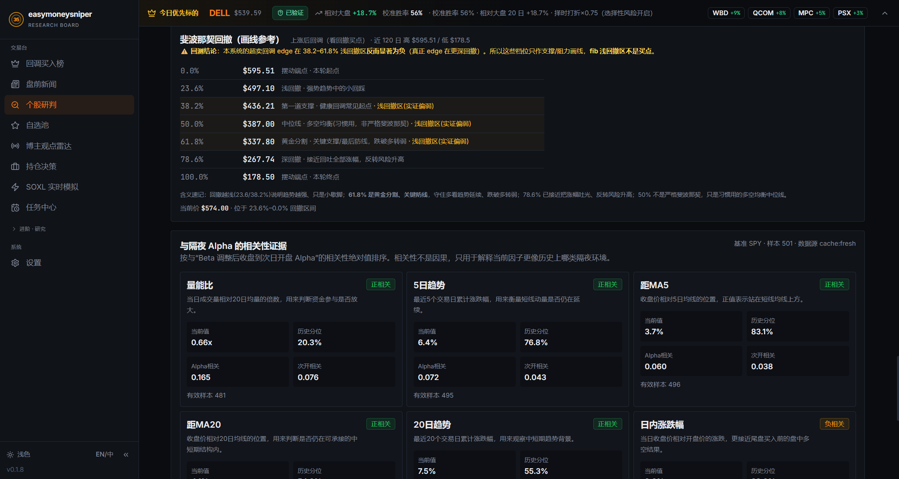

[查看完整原图](assets/screenshots/desktop/07-stock-evidence.png)

### 盘前新闻：宏观事件卡片与阅读反馈

入口：`/premarket-news`

通过卡片逐条阅读盘前资讯。示例将美联储相关事件归为全市场宏观新闻，展示中文摘要、媒体来源、时间、主题、新闻方向、影响范围与冲击评分，使读者快速判断事件需要从大盘还是个股角度复核。

侧栏提供预计开盘影响、波动带宽和相关指数入口，原文与出处可展开查看；底部勾选与跳过按钮用于处理阅读队列和反馈。页面保留后台刷新状态与最新入库时间。冲击分、方向和影响带宽是不同维度，应配合正文与出处理解其含义。

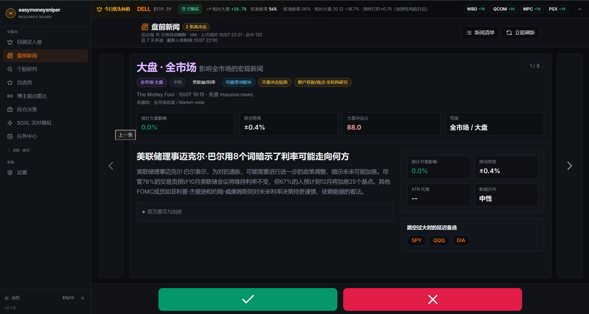

[查看完整原图](assets/screenshots/desktop/08-news-cards.png)

### 盘前新闻：筛选清单与跨事件比较

入口：`/premarket-news/list`

以清单集中比较宏观与个股新闻，支持时间范围、未读状态和分数筛选，并提供手动更新入口。顶部统计队列规模、正负面数量、可能板块扩散与股票池覆盖状态，适合检查盘前阅读任务的范围。

每行同时展示标的、新闻要点、事件标签、冲击分、开盘影响、行情状态、发布时间和赛道或来源。截图中的“待补齐”状态保留，提醒读者该行行情上下文尚未准备完成；可据此先复核资讯，再等待行情数据完善。

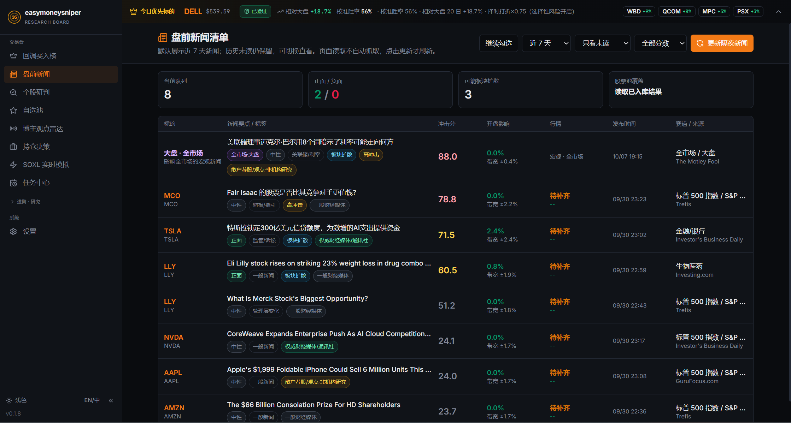

[查看完整原图](assets/screenshots/desktop/09-news-list.png)

### 自选池：研究范围、备注与批量分析

入口：`/watchlist`

维护个人研究股票池，支持单只添加、填写关注原因和批量导入，并提供自选池三层分析入口。截图展示实际自选列表及备注，说明研究范围可以由使用者主动维护，模型运行时也会明确标注来源池。

列表汇总现价、当日表现、市值与 PE、行业、20 日表现、60 日 Alpha、回调或启动状态、GEX、财报时间和 Alpha 胜率。页面注明 Alpha 基准为纳斯达克／QQQ，并显示后台补充进度；数据不完整、无信号和已有信号的状态可以分别辨认。

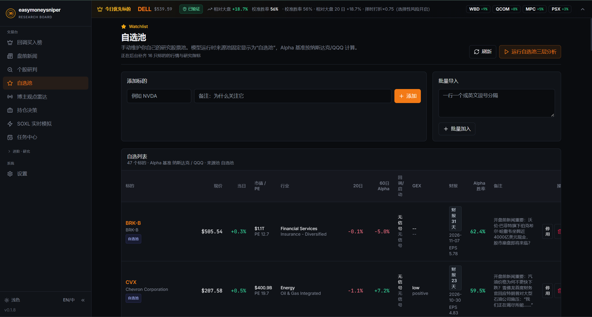

[查看完整原图](assets/screenshots/desktop/10-watchlist.png)

### 博主观点雷达：视频摘要与赛道传导

入口：`/creator-opinions`

把长视频观点整理为可浏览的研究线索。每条记录保留博主、视频标题、发布时间、字幕与观点处理状态、语言和原视频链接，同时用摘要概括视频讨论的宏观背景、行业变化与个股判断。

个股观点与赛道传导分栏呈现，并以 bullish、bearish、neutral、mixed 标签区分倾向。读者可以对比不同来源对同一股票或主题的看法，再回到原视频确认语境；这些标签表达内容中的观点，不是项目对标的的统一结论。

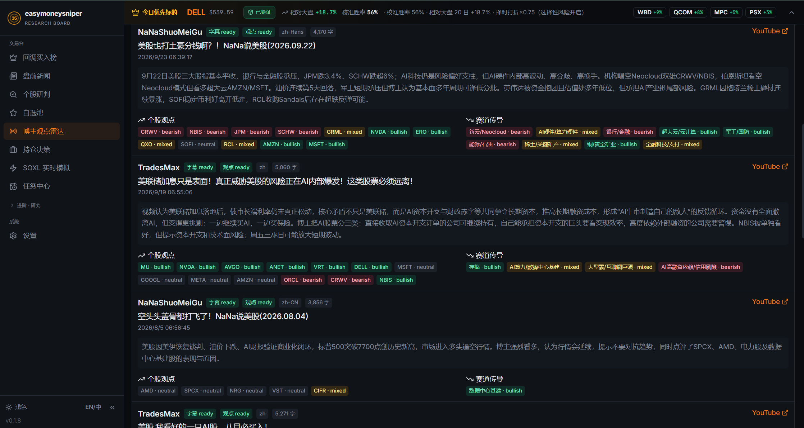

[查看完整原图](assets/screenshots/desktop/11-creator-radar.png)

### 任务中心：每日扫描进度与运行结果

入口：`/batch-tasks`

查看每日三层扫描是否完成、当前处理进度、计划时间、启用状态和最近运行结果。截图保留本次 running 与上次 failed 两种状态，让读者了解任务中心如何区分正在执行的扫描与历史执行记录。

页面支持继续未完成池、强制重跑和恢复榜单，并按股票池显示复用或完成情况；新闻更新、事件补充和 AI 复核另有状态说明。飞书移动端区域在截图中显示隧道未运行，没有公开访问地址。这里适合定位数据准备或扫描任务的卡点，再选择相应恢复操作。

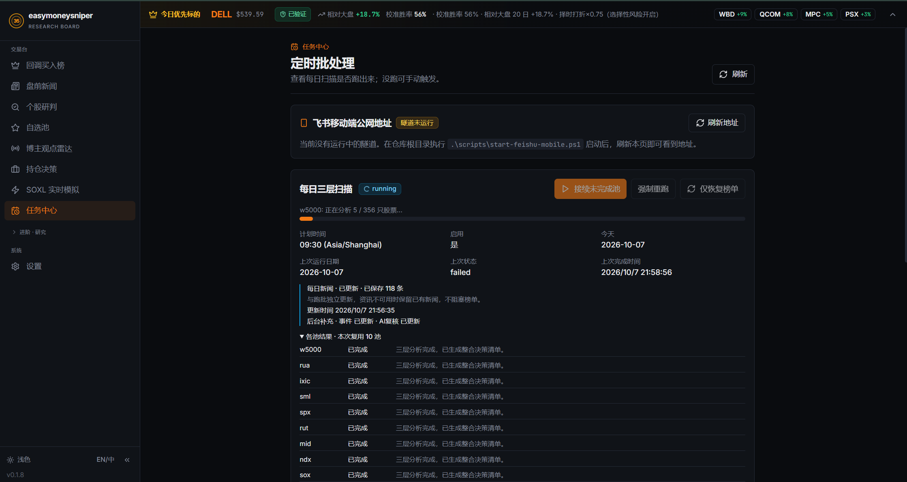

[查看完整原图](assets/screenshots/desktop/12-task-center.png)

## 移动端功能展示

移动端图片保持原有版本，按手机布局展示常用研究入口。

### 移动端 · 榜单

入口：`/m`。以手机卡片布局查看研究候选，并进入个股研究。

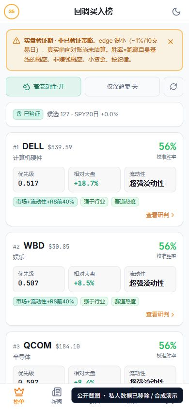

[查看原图](assets/screenshots/27-mobile-board.jpg)

### 移动端 · 新闻

入口：`/m/news`。在手机布局中阅读盘前资讯和研究线索。

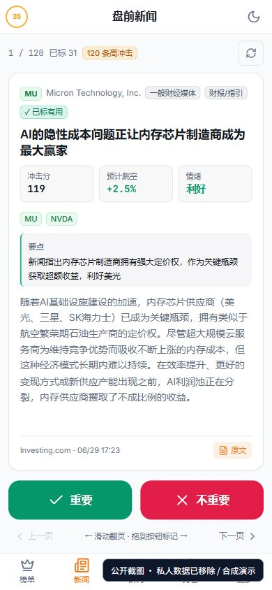

[查看原图](assets/screenshots/28-mobile-news.jpg)

### 移动端 · 个股

入口：`/m/stock?symbol=SPY`。展示个股报价、研究行动区间、风险价位与核心研究信息。

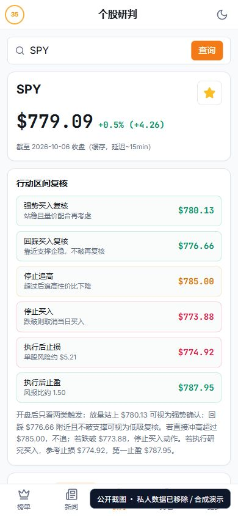

[查看原图](assets/screenshots/29-mobile-stock.jpg)

### 移动端 · 持仓

入口：`/m/portfolio`。以手机布局查看账户摘要、持仓与仓位研究建议。 资金与持仓为合成演示数据。

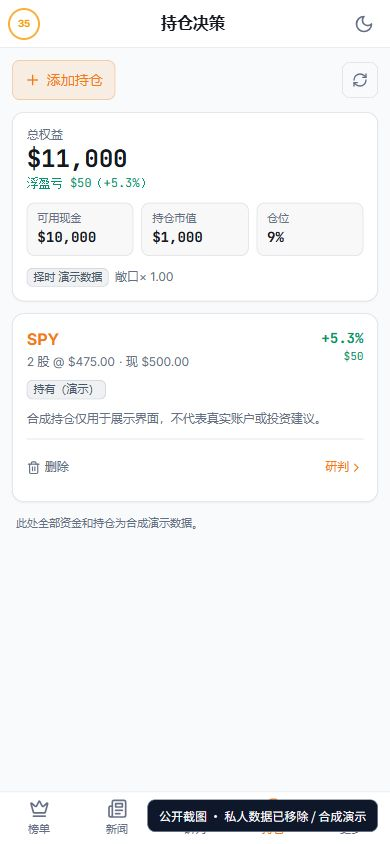

[查看原图](assets/screenshots/30-mobile-portfolio.jpg)

### 移动端 · 自选

入口：`/m/watchlist`。在手机上维护和查看自选研究范围。

[查看原图](assets/screenshots/31-mobile-watchlist.jpg)

### 移动端 · 更多

入口：`/m/more`。汇总交易台、进阶研究和系统入口，可切换到桌面完整版。

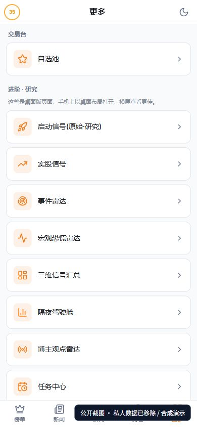

[查看原图](assets/screenshots/32-mobile-more.jpg)

## 完整页面与功能索引

以下保留全部页面和看板标签入口。图片列链接至本次提供的对应展示；未提供原图的页面以功能说明收录。

| 页面 | 路由／入口 | 功能说明 | 截图 |
| --- | --- | --- | --- |
| 回调买入榜 | `/` | 按回调信号、历史校准口径、相对大盘强度和流动性筛选研究候选；可切换高流动性、深超卖与单腿期权快照。 | [查看](#01-priority-overview) |
| 持续监测 | `/ → 持续监测` | 跟踪候选首次出现、连续观察、排名变化及失效状态，复核信号的生命周期。 | 未提供对应桌面原图 |
| 兑现对账 | `/ → 兑现对账` | 查看已记录预测的结算、命中口径、净超额、可靠性分桶和排名分桶；区分前向记录与历史回放。 | 未提供对应桌面原图 |
| 今日篮子 | `/ → 今日篮子` | 以预算、候选数量和权重方式生成候选研究篮子，辅助比较组合分配。 | 未提供对应桌面原图 |
| 盘前新闻 · 卡片 | `/premarket-news` | 用卡片浏览新闻，查看涉及标的、事件解释与重要性；通过勾叉反馈调整后续新闻偏好。 | [查看](#08-news-cards) |
| 盘前新闻 · 清单 | `/premarket-news/list` | 以列表方式查看盘前资讯，按页面提供的条件筛选与复核新闻上下文。 | [查看](#09-news-list) |
| 个股研判 | `/single-stock-overnight?symbol=SPY` | 汇总公司与赛道背景、价格图表、技术指标、关键行动区间、风险信息和研究复核；可加入自选池。GilData 的规范化研究样本可作为补充上下文。 | [查看](#03-stock-chart) |
| 自选池 | `/watchlist` | 单只或批量添加标的、管理启用状态、备注和删除；汇总自选标的的研究指标并触发自选范围复核。 | [查看](#10-watchlist) |
| 博主观点雷达 | `/creator-opinions` | 汇总配置频道的视频记录、观点、股票标签与赛道信号，将非结构化观点纳入研究观察。 | [查看](#11-creator-radar) |
| 持仓决策 | `/portfolio` | 录入持仓、成本与可用现金，查看持仓权重、浮动盈亏、加仓／持有／减仓／平仓研究建议和风险价位。 | 未提供对应桌面原图 |
| SOXL 实时模拟 | `/soxl-quant` | 展示实时行情连接状态、模拟账户、信号、成交与权益曲线，以及训练／验证／测试分段回测入口。 | 未提供对应桌面原图 |
| 任务中心 | `/batch-tasks` | 查看定时扫描、批处理进度、榜单快照、样本外采集和校准曲线状态；配置后的移动访问地址也在这里展示。 | [查看](#12-task-center) |
| 启动信号 | `/launch-signal` | 配置研究股票池与筛选参数，查看量化启动信号排名和历史影响校准入口。 | 未提供对应桌面原图 |
| 实股信号 | `/stock-signals` | 通过实股机会筛选工具浏览机会观察清单，查看信号详情与研究解释。 | 未提供对应桌面原图 |
| 事件雷达 | `/event-radar` | 围绕统一股票池查看短期启动事件、扫描参数、历史影响校准及排名。 | 未提供对应桌面原图 |
| 宏观恐慌雷达 | `/macro-panic-radar` | 查看 VIX／可用代理指标、市场恐慌状态、系统性危机过滤和计算来源说明。 | 未提供对应桌面原图 |
| 三维信号汇总 | `/signal-dashboard` | 将多个研究维度汇总到统一表格，结合历史验证、研究概率、风险收益与可执行性完成复核。 | 未提供对应桌面原图 |
| 隔夜驾驶舱 | `/overnight-cockpit` | 围绕尾盘到次日开盘的研究场景，比较指数池候选、基准、隔夜信息和风险上下文。 | 未提供对应桌面原图 |
| Alpha 因子库 | `/alpha-zoo` | 浏览 Qlib 158、Kakushadze 101、GTJA 191 与 Academic 四类预置因子；可按库、主题与股票池筛选。 | 未提供对应桌面原图 |
| Alpha 因子详情 | `/alpha-zoo/academic_carhart_mom` | 展示单因子的公式、主题、适用股票池、频率、预热要求、备注与源码入口。 | 未提供对应桌面原图 |
| Alpha Bench | `/alpha-zoo/bench` | 配置因子库、股票池与时间区间，运行批量评估并查看进度和结果。 | 未提供对应桌面原图 |
| 研究助手 | `/agent` | 用自然语言发起研究，查看工具执行反馈、会话与研究产物；模型与 MCP 工具由使用者配置。 | 未提供对应桌面原图 |
| 回测运行详情 | `/runs/:runId` | 查看运行状态、权益与回撤、指标、交易记录、策略代码、报告和可用验证产物。 | 未提供对应桌面原图 |
| 策略对比 | `/compare` | 选择两次运行，对比权益与回撤曲线及关键回测指标。 | 未提供对应桌面原图 |
| 相关性矩阵 | `/correlation` | 输入多资产代码、窗口期与 Pearson／Spearman 方法，展示相关性矩阵。 | 未提供对应桌面原图 |
| 设置 | `/settings` | 配置本地 API 认证、模型提供商、模型名、生成参数与可选行情数据源。GilData MCP 地址和 token 当前通过本地 agent/.env 配置。 | 未提供对应桌面原图 |
| 移动端 · 榜单 | `/m` | 以手机卡片布局查看研究候选，并进入个股研究。 | [查看](#27-mobile-board) |
| 移动端 · 新闻 | `/m/news` | 在手机布局中阅读盘前资讯和研究线索。 | [查看](#28-mobile-news) |
| 移动端 · 个股 | `/m/stock?symbol=SPY` | 展示个股报价、研究行动区间、风险价位与核心研究信息。 | [查看](#29-mobile-stock) |
| 移动端 · 持仓 | `/m/portfolio` | 以手机布局查看账户摘要、持仓与仓位研究建议。 | [查看](#30-mobile-portfolio) |
| 移动端 · 自选 | `/m/watchlist` | 在手机上维护和查看自选研究范围。 | [查看](#31-mobile-watchlist) |
| 移动端 · 更多 | `/m/more` | 汇总交易台、进阶研究和系统入口，可切换到桌面完整版。 | [查看](#32-mobile-more) |
